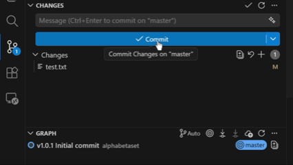

# COMMITVER

**Simple Git version management** - Automatically add version numbers to your commit messages with one click.

## How It Works



You can add to version number at the beginning of your commit comment.

If you don't want to write a comment, you can simply press the commit button.

**Version Format: Major.Minor.Patch**

Example: v1.0.2
- Major: 1 (Breaking changes)
- Minor: 0 (New features)  
- Patch: 2 (Bug fixes)

## Features

- **Automatic version prefixing** - Version numbers added to commit messages
- **Automatic version incrementing** - Patch version increments on each commit automatically  
- **Zero configuration** - Works out of the box
- **Simple to use** - Just commit normally
- **VS Code integration** - Quick commit command available

## Quick Start

### Method 1: Use Git Commands (Recommended)

Just commit normally - version is added automatically:

```bash
# Make changes
echo "New feature" > feature.txt

# Stage and commit
git add feature.txt
git commit -m "Add new feature"

# Result: v1.0.2 Add new feature
```

### Method 2: VS Code Extension

Use the quick commit command:

```bash
# Open command palette
Ctrl+Shift+P → "Quick Commit with Version"

# Enter your message and commit automatically
```

## What Gets Installed

**Git hooks** for automatic versioning  
**package.json** with version management  
**VS Code extension** for quick commits  
**Zero setup required** - works immediately  

## Usage Examples

### Basic Git Usage

```bash
# Empty message - auto generates "Auto commit"
git commit -m ""
# Result: v1.0.2 Auto commit

# With your message
git commit -m "Fix bug"
# Result: v1.0.3 Fix bug

# Multiple words
git commit -m "Add new feature and update docs"
# Result: v1.0.4 Add new feature and update docs
```

### VS Code Extension

```bash
# Press Ctrl+Shift+P
# Search: "Quick Commit with Version"
# Enter message and press Enter
# Done!
```

## Current Configuration

The system uses these settings by default:
- Format: `v{version} {message}`
- Version source: `package.json`
- Auto-increment: **Patch version** (x.x.x+1) - Perfect for continuous development

### Why Patch Version?

**Patch version auto-increment** is ideal for:
- **Daily development** - Small changes and bug fixes
- **Continuous integration** - No manual version management needed
- **Team collaboration** - Consistent version tracking
- **Bug fix tracking** - Clear history of small improvements

This means you can focus on coding while versions handle themselves automatically.

---

**Made with ❤️ for simple version management**
